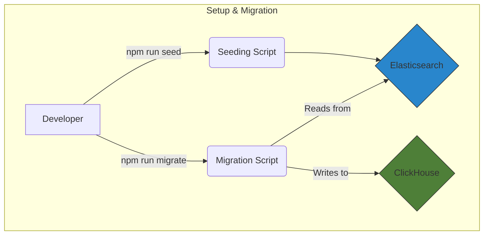

# Elasticsearch to ClickHouse Data Transfer Demo

A robust data migration system for transferring data from Elasticsearch to ClickHouse, built with TypeScript and Docker. This project is designed for reliability, observability, and ease of use.

## 🎯 Core Features

- **🐳 Dockerized Environment**: All services are containerized for easy setup.
- **🚀 High-Performance Migration**: Utilizes efficient batch processing for transferring large datasets.
- **🔍 Data Validation**: Includes a console-based verification step to compare data samples from both databases.
- **📝 Comprehensive Logging**: Detailed logs provide insight into every step of the process.
- **🧪 Full Test Coverage**: A complete suite of integration tests ensures system reliability.

## 🏗️ Architecture

This project uses a clean, decoupled architecture:

- **Elasticsearch**: The primary data source.
- **ClickHouse**: The destination database, optimized for analytical queries.
- **Node.js/TypeScript Application**: Orchestrates the seeding and migration processes.



## 📦 Prerequisites

- Docker and Docker Compose
- Node.js & npm

## 🚀 Quick Start

Follow these steps to get the environment up and running.

### 1. Install Dependencies and Build

First, install the necessary Node.js packages and compile the TypeScript code:

```bash
npm install
npm run build
```

### 2. Configure Environment Variables (Optional)

All settings are pre-configured with defaults. To customize, create a `.env` file from the example:

```bash
cp .env.example .env
```

Review and edit the variables in `.env` if needed.

### 3. Start All Services

Launch the entire stack using Docker Compose:

```bash
docker-compose up -d
```

This command will start:

- **Elasticsearch**: `http://localhost:9200`
- **Kibana**: `http://localhost:5601`
- **Metabase**: `http://localhost:3000`
- **ClickHouse**: `http://localhost:8123`

Please wait a few minutes for all services to initialize.

### 4. Seed Elasticsearch with Data

Populate the `users` index in Elasticsearch with mock data:

```bash
npm run seed
```

### 5. Migrate Data to ClickHouse

Run the script to transfer data from Elasticsearch to the ClickHouse `users` table:

```bash
npm run migrate
```

The script will log its progress and perform a final data verification check in the console.

## ✨ Data Visualization

This project includes support for visualizing data in both Elasticsearch (with Kibana) and ClickHouse (with Metabase).

### Visualizing in Kibana

This project includes an automated script to set up a Kibana visualization for monitoring the `users` index.

**1. Set Up the Visualization**

After following the **Quick Start** guide to get your environment running and seeded with data, run the setup script:

```bash
# Ensure the script is executable
chmod +x setup-kibana-dashboard.sh

# Run the setup
./setup-kibana-dashboard.sh
```

**2. Observe the Data Flow**

1.  **Open the Visualization**: Access the link provided by the setup script. You should see the count of seeded users.
2.  **Turn on Auto-Refresh**: In Kibana, set **Auto-refresh** (in the top-right time picker) to 5 or 10 seconds.
3.  **Run `npm run seed` again**: While watching the visualization, you will see the count drop to **0** and then return to the total seeded amount, confirming the cleanup-and-seed process visually.

### Visualizing in Metabase

You can use Metabase to connect to your ClickHouse database and observe the results of the data migration. The version of Metabase included in this project has the ClickHouse driver built-in, so no external downloads are required.

**1. First-Time Metabase Setup**

1.  **Access Metabase**: Open `http://localhost:3000`.
2.  **Create Admin Account**: Follow the on-screen instructions.
3.  **Add Database**: Skip the initial prompt to add data ("I'll add my data later").

**2. Connect to ClickHouse**

1.  Click the gear icon (⚙️) -> **Admin Settings** -> **Databases** -> **Add database**.
2.  **Database type**: Select **ClickHouse** from the dropdown list.
3.  **Host**: `clickhouse`
4.  **Port**: `8123`
5.  **Username**: `default`
6.  **Password**: (leave blank)
7.  **Database name**: `default`
8.  Save the connection.

**3. Observe the Migration**

1.  **Create a Question**: Go to **+ New** -> **Question**, select your **ClickHouse DB**, and the **users** table (after running the migration script at least once).
2.  **View State**: Summarize by **"Count of rows"**. You will see the current count of users. Save the question.
3.  **Run the Migration**:
    ```bash
    npm run migrate
    ```
4.  **View Updated State**: Refresh your question in Metabase. The count will now show the total number of migrated users, confirming a successful transfer.

## 🧪 Running Tests

To run the full suite of integration tests:

```bash
npm test
```

## 🧹 Cleanup

To stop and completely remove all containers, networks, and volumes:

```bash
docker-compose down -v
```

## 📄 License

This project is licensed under the MIT License.
