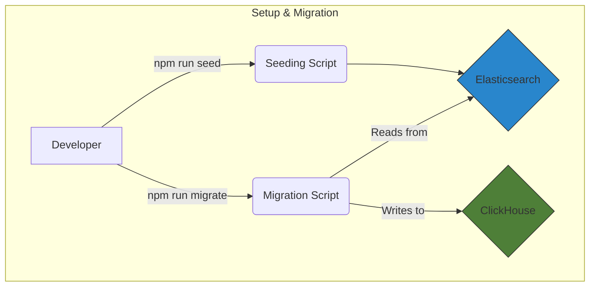

# Elasticsearch to ClickHouse Data Transfer Demo

A robust data migration system for transferring data from Elasticsearch to ClickHouse, built with TypeScript and Docker. This project is designed for reliability, observability, and ease of use.

## 🎯 Core Features

- **🐳 Dockerized Environment**: All services are containerized for easy setup.
- **🚀 High-Performance Migration**: Utilizes efficient batch processing for transferring large datasets.
- **🔍 Data Validation**: Includes a console-based verification step to compare data samples from both databases.
- **📝 Comprehensive Logging**: Detailed logs provide insight into every step of the process.
- **🧪 Full Test Coverage**: A complete suite of integration tests ensures system reliability.

## 🏗️ Architecture

This project uses a clean, decoupled architecture:

- **Elasticsearch**: The primary data source.
- **ClickHouse**: The destination database, optimized for analytical queries.
- **Node.js/TypeScript Application**: Orchestrates the seeding and migration processes.



## 📦 Prerequisites

- Docker and Docker Compose
- Node.js & npm

## 🚀 Quick Start

Follow these steps to get the environment up and running.

### 1. Install Dependencies and Build

First, install the necessary Node.js packages and compile the TypeScript code:

```bash
npm install
npm run build
```

### 2. Configure Environment Variables (Optional)

All settings are pre-configured with defaults. To customize, create a `.env` file from the example:

```bash
cp .env.example .env
```

Review and edit the variables in `.env` if needed.

### 3. Start All Services

Launch the entire stack using Docker Compose:

```bash
docker-compose up -d
```

This command will start:

- **Elasticsearch**: `http://localhost:9200`
- **ClickHouse**: `http://localhost:8123`

Please wait a few minutes for all services to initialize.

### 4. Seed Elasticsearch with Data

Populate the `users` index in Elasticsearch with mock data:

```bash
npm run seed
```

### 5. Migrate Data to ClickHouse

Run the script to transfer data from Elasticsearch to the ClickHouse `users` table:

```bash
npm run migrate
```

The script will log its progress and perform a final data verification check in the console.

## 🧪 Running Tests

To run the full suite of integration tests:

```bash
npm test
```

## 🧹 Cleanup

To stop and completely remove all containers, networks, and volumes:

```bash
docker-compose down -v
```

## 📄 License

This project is licensed under the MIT License.
